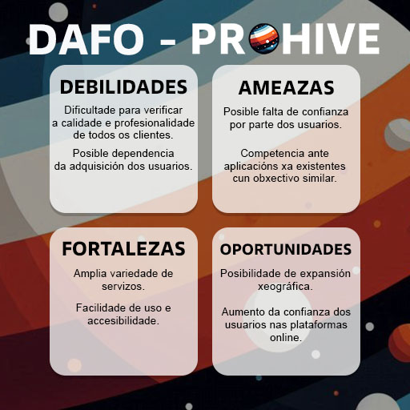
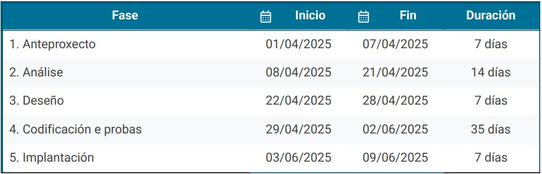
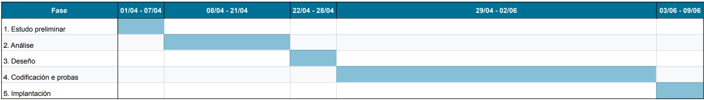

# Anteproxecto fin de ciclo

- [Anteproxecto fin de ciclo](#anteproxecto-fin-de-ciclo)
  - [1- Descrición do proxecto](#1--descrición-do-proxecto)
  - [2- Empresa](#2--empresa)
    - [2.1- Idea de negocio](#21--idea-de-negocio)
    - [2.2- Xustificación da idea](#22--xustificación-da-idea)
    - [2.3- Segmento de clientes](#23--segmento-de-clientes)
    - [2.4- Competencia](#24--competencia)
    - [2.5- Proposta de valor](#25--proposta-de-valor)
    - [2.6- Forma xurídica](#26--forma-xurídica)
    - [2.7- Investimentos](#27--investimentos)
      - [2.7.1- Custos](#271--custos)
      - [2.7.2- Ingresos](#272--ingresos)
    - [2.8- Viabilidade](#28--viabilidade)
      - [2.8.1- Viabilidade técnica](#281--viabilidade-técnica)
      - [2.8.2 - Viabilidade económica](#282---viabilidade-económica)
      - [2.8.3- Conclusión](#283--conclusión)
  - [3- Requirimentos técnicos](#3--requirimentos-técnicos)
  - [4- Planificación](#4--planificación)

## 1- Descrición do proxecto
O proxecto consiste na elaboración dunha páxina na que poidas buscar unha empresa, autónomo ou asesor para que poidan realizar un servicio para tí de forma rápida e sencilla. Sendo así o propósito principal que as empresas ou traballadores poderían publicitarse e os usuarios da páxina poidan buscar os servicios que deseen nun mesmo lugar.

Os obxectivos principais serían poder ter unha única web onde as persoas poidan publicitar os servicios que ofrecen e os usuarios desta poidan contratar moitas clases de servicios nun mesmo lugar, conectando así aos profesionais (de agora en diante, os clientes) cos usuarios.

Esta aplicación abre unha oportunidade de negocio, xa que este proxecto pode verse económicamente beneficiada mediante o uso da publicidade, ademáis de que os nosos clientes terían a oportunidade de pagar unha suscripción mensual onde se lle permita facer anuncios ilimitados, certa ventaxa nas búsquedas dos usuarios aparecendo dos primeiros nestas, e unha maior posibilidade de saír no apartado de "Destacados".

## 2- Empresa

### 2.1- Idea de negocio

Tendo en conta a idea mencionada no anterior punto, teríamos unha páxina web para conectar empresas, autónomos e asesores cos usuarios como produto central.

O valor engadido sería que así, os usuarios, poderían contactar de forma sencilla cunha empresa, autónomo ou asesor que poida satisfaccer algunha necesidade concreta, dándolle como utilidade o poder buscalo nun solo lugar de forma rápida e sencilla.

Ademáis de que tamén serviría para os clientes poder publicitar os seus servicios, e lóxicamente obter unha valoración por eles. Terían o seu perfil onde poden ver os seus anuncios activos e así acceder a eles.

### 2.2- Xustificación da idea

A idea do proxecto xurdeu a partir de que a miña familia precisou de varios servicios nos últimos meses, sendo varios deles atrasados durante moitos anos (por exemplo, non contratar un electricista para poñer unhas lámparas na casa durante case 20 anos) debido a non saber ónde buscar algunha empresa ou autónomo que poida satisfaccer as súas necesidades. Desta forma, o obxectivo que ten a creación desta web sería que non se repitan máis casos coma este, e os usuarios poidan buscar de forma rápida, sencilla e nun mesmo lugar prácticamente calquera servicio.

As necesidades a cubrir serían: 
- Para os clientes: poder publicitar os seus servicios e así aumentar o seu número de ventas, e por ende, de beneficios.
- Para os usuarios: poder encontrar de forma rápida, sencilla e nun mesmo lugar un servicio que poida satisfacer as súas necesidades (como pode ser contratar un pintor, arquitecto, desenvolvedor web...).

Existen aplicacións deste tipo como son Fiverr ou incluso Milanuncios, aínda que no caso de Fiverr está máis orientado ao apartado tecnolóxico ou marketing, e Milanuncios está máis orientado á venta de productos físicos.

Según Scopen, as empresas españolas destinan un aproximado do 3,7% da súa facturación á publicidade. Este porcentaxe non é excesivamente alto, e aínda que se aproxima que o nivel de satisfacción é dun 93%, pensamos que darlle un espazo ás empresas para publicitarse incluso de forma gratuita sería beneficioso para eles, ao non ter que dirixir tanto da súa facturación á publicidade.

Aínda que existen algunhas solucións no mercado, estas son insuficientes debido ao que abarcan, xa que ningún está tan orientado á publicidade de servicios de empresas.

DAFO:

### 2.3- Segmento de clientes

A aplicación estará dirixida a:
- Empresas, autónomos e asesores de todo tipo (clientes): estos poderán publicitar os seus servicios, publicando datos de contacto para que as persoas que queiran contratalos poidan contactar con eles. Poderán anunciar 3 servicios mensuais en caso de utilizar o plan gratuito da web. En caso de pagar pola suscripción mensual, poderán anunciar servicios infinitos, ademáis de que terán unha maior subida das ventas debido a que aparecerán dos primeiros nas búsquedas dos usuarios e terán máis posibilidades de sair no apartado de "Destacados".
- Persoas interesadas en contratar un servicio (usuarios): Poderán acceder á páxina para contratar a calquera dos nosos clientes.

### 2.4- Competencia

> _EXPLICACIÓN_: Neste apartado deberase indicar que outras empresas operan no mercado. Que cota de mercado teñen e como están posicionadas. Existencia de productos/servizos substitutivos. Como están posicionados.
As empresas que compiten no mercado serían as seguintes:
- **Fiverr**: plataforma na cal unha persoa pode ofrecer un servicio, sendo o máis parecido a ProHive, sen embargo, este está máis que nada dirixido ao apartado tecnolóxico, sendo unha plataforma coñecida por ser un lugar idóneo para buscar persoas para que fagan partes de videoxogos (música, diseño gráfico, modelaxe 3D...).
- **Upwork y Freelancer.com**: plataformas nas cales podes contratar a freelancers de gran parte de ámbitos. A gran diferencia entre estas dúas plataformas e ProHive sería que tanto Upwork como Freelancer.com son dirixidas a servicios a realizar a distancia (como é o diseño dunha páxina web, diseño gráfico, marketing...).

Esas tres plataformas son as mellor posicionadas neste mercado.

### 2.5- Proposta de valor

> _EXPLICACIÓN_: **Apartado fundamental.**
>
> - En que se diferencia fronte os competidores.
> - Que melloras terá fronte os competidores.
> - Que valor aporta ao mercado.
> - ¿Porqué mercarán/contratarán este producto/servizo/idea fronte o resto?

### 2.6- Forma xurídica

Tendo en conta que o desarrollo da páxina está creado por unha soa persoa, o que mellor se adapta sería ser autónomo.

Esta elección, ademáis de ser polo número de empleados (unha persoa), tamén sería por dúas principais ventaxas: 
1. Non tería que aportar capital inicial.
2. Existencia de axudas para autónomos.

### 2.7- Investimentos

#### 2.7.1- Custos

- Fixos:

| Gasto | Cantidade |
|----------|--------------------|
| Equipamento informático | (1000€ portátil, 75€ segunda pantalla, 24€ teclado, 20€ ratón) |
| Mobles | 500€ (mesa + silla) |
| Internet | XXX€/ano |
| Luz, auga e calefacción | XXX€/ano |
| Licencia de software (Adobe Creative Cloud) | 362,75€/ano |
| Dominio | XXX€/ano |

- Variables:

| **Gasto** | **Cantidade** | **Notas** |
|----------|--------------------|----------------------|
| Hosting | XXX€/ano | Dependendo do éxito da plataforma, habería que ir ampliando o servicio de hosting |
| Salario | 16.576/ano | Se os ingresos van aumentando notablemente, podería plantearse a subida de salario |
| Cuota da Seguridade Social (mínima) | 960€/ano | Ao igual que o salario, podería plantearse a subida da cuota dependendo dos ingresos |
| Márketing | XXX€/ano | Ao igual que o salario e a cuota da SS, podería plantearse a subida da inversión en márketing |

- Total:

| **Fixos** | **Variables** | **Total** |
|-------|-----------|-------|
| XXXXX€ | XXXXX€ | XXXXX€ |

#### 2.7.2- Ingresos

> _EXPLICACIÓN_: Neste apartado indicarase unha previsión de ventas e unha política de prezos. Isto implicar apuntar unha previsión de ventas e unha política de prezos.
As formas que ProHive terá de xerar ingresos serán as seguintes:
- Comisión por ventas: ProHive obterá un 10% como comisión en cada un dos pagos que os usuarios realizarán aos profesionais da páxina.
- Publicidade: Calquera evento/organización/anuncio de turismo terá a posibilidade de publicitarse na páxina (a forma de banner ou fotos) a cambio dun custo anual ou mensual.
- Suscripción: Os profesionais que queiran formar parte dos negocios adheridos a ProHive terán a posibilidade de pagar unha suscripción para liberarse da comisión á plataforma.
- Donacións: Aceptamos donacións.

Por aquí temos as tablas de prezos das suscripcións e publicidades:

<table style="text-align:center">
  <tr>
    <td colspan="2"><b>Suscripcións</b></td>
  </tr>
  <tr>
    <td><b>Mensual</b></td>
    <td><b>Anual</b></td>
  </tr>
  <tr>
    <td><b>XXX€</b></td>
    <td><b>XXXX€</b></td>
  </tr>
</table>

| **Publicidade** | **Publicidade** |
|-------------|-----------|
| **Mensual** | **Anual** |
| 100€ | 1000€ |

### 2.8- Viabilidade

#### 2.8.1- Viabilidade técnica

> _EXPLICACIÓN_: Neste subapartado deberás defender tendo en conta os datos xa aportados, a viabilidade da realización do proyecto.
> Evidentemente, para poder xustificar a viabilidade económica do proyecto deberás ter en conta os ingresos. **Ainda que está na parte de empresa, este apartado é interesante dende o punto de vista técnico**
>
> - Será posible dispoñer dos recursos humanos e medios de produción necesarios (materias primas, maquinaria, instalacións, etc.)?
> - Existe algún impedimento técnico que dificulte o proceso produtivo?

#### 2.8.2 - Viabilidade económica

> _EXPLICACIÓN_: Neste subapartado deberás defender con datos a viabilidade da realización do proyecto, para elo debes indicar os custos e investimentos:

#### 2.8.3- Conclusión

> - É viable?
> - Os beneficios do proxecto son superiores aos costes?
> - As perdas poden cubrirse vía financiamento (por parte da administración pública, con subvencións, etc)?

## 3- Requirimentos técnicos

- **Infraestructura**: XAMPP.
- **Backend**: PHP, MySQL - phpMyAdmin, API Rest con PHP.
- **Frontend:** HTML5, CSS3, JavaScript, AJAX
- **Prototipo**: Figma
- **Librerías**: JavaScript: AOS, Math.js

## 4- Planificación
NO ES CALCAR LO QUE YO OS PONGO DE LAS FASES DE ENTREGA, ES LO QUE CREEIS TU Y LAS FASES QUE REALMENTE APLICARÍAS

[**<-Anterior**](../../README.md)
