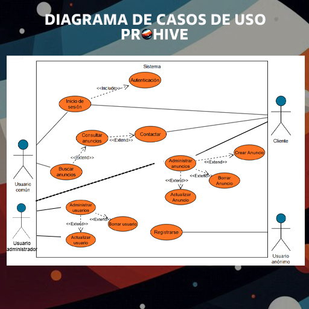

# FASE DE DESEÑO

- [FASE DE DESEÑO](#fase-de-deseño)
  - [1- Diagrama da arquitectura](#1--diagrama-da-arquitectura)
  - [2- Casos de uso](#2--casos-de-uso)
  - [3- Diagrama de Base de Datos](#3--diagrama-de-base-de-datos)
  - [4- Deseño de interface de usuarios](#4--deseño-de-interface-de-usuarios)

## 1- Diagrama da arquitectura

## 2- Casos de uso

## 3- Diagrama de Base de Datos

- **Modelo Entidade/relación**

- **Modelo relacional**

**Usuarios** (id_usuario (PK),nombre,apellidos,email,password,tipo_usuario (FK de TipoUsuario))

**TipoUsuario** (id (PK), tipo_nombre)

**Anuncios** (id_anuncio (PK), id_cliente (FK de Usuarios), imagen, nombre, texto, precio)

**Mensajes** (id_mensaje (PK), id_emisor (FK de Usuarios), id_receptor (FK de Usuarios), fecha, hora, texto)

**Valoraciones** (id_valoracion (PK), id_anuncio (FK de Anuncios), id_usuario (FK de Usuarios), puntuacion, texto)

## 4- Deseño de interface de usuarios

Podes visitar o prototipo da páxina pulsando [aquí](https://www.figma.com/design/YkZ0R1c2W19m5aeZLIEK6e/ProHive?node-id=0-1&p=f&t=w8pCzs5vOATi2o5e-0)

[**<-Anterior**](../../README.md)
