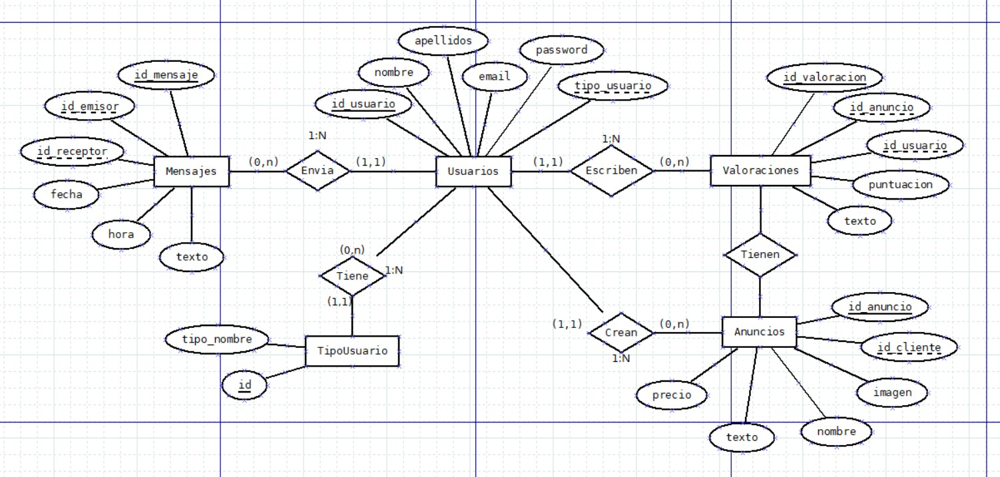

# FASE DE DESEÑO

- [FASE DE DESEÑO](#fase-de-deseño)
  - [1- Diagrama da arquitectura](#1--diagrama-da-arquitectura)
  - [2- Casos de uso](#2--casos-de-uso)
  - [3- Diagrama de Base de Datos](#3--diagrama-de-base-de-datos)
  - [4- Deseño de interface de usuarios](#4--deseño-de-interface-de-usuarios)

## 1- Diagrama da arquitectura

> *EXPLICACIÓN:* Incluír os diagramas de arquitectura que representen de forma gráfica a aplicación, os seus compoñentes e a súa interrelación: front-end, back-end, bases de datos, nube, microservizos, etc.

## 2- Casos de uso

> *EXPLICACIÓN:* Facer os diagramas de casos de uso que representen como as persoas usuarias interaccionan co sistema.
>
>Deben incluírse o(s) tipo(s) de usuario implicados en cada caso de uso.

## 3- Diagrama de Base de Datos

> *EXPLICACIÓN:* Neste apartado incluiranse os diagramas relacionados coa Base de Datos:
>
> - Modelo Entidade/relación
> - Modelo relacional
>
> Pódese entregar a captura do phpMyAdmin se se emprega MariaDB como Modelo relacional.
- **Modelo Entidade/relación**

- **Modelo relacional**

**Usuarios** (id_usuario (PK),nombre,apellidos,email,password,tipo_usuario (FK de TipoUsuario))
**TipoUsuario** (id (PK), tipo_nombre)
**Anuncios** (id_anuncio (PK), id_cliente (FK de Usuarios), imagen, nombre, texto, precio)
**Mensajes** (id_mensaje (PK), id_emisor (FK de Usuarios), id_receptor (FK de Usuarios), fecha, hora, texto)
**Valoraciones** (id_valoracion (PK), id_anuncio (FK de Anuncios), id_usuario (FK de Usuarios), puntuacion, texto)

## 4- Deseño de interface de usuarios

> *EXPLICACIÓN:* Neste apartado deben incluírse unha mostra representativan dos mockups da aplicación. Estes mockups deben incluír todas as vistas da aplicación, é dicir, todas as páxinas diferentes que unha persoa usuaria (de calquera tipo) vai poder ver. Tamén se debe incluír información de como navegar dunha ventá a outra.
>
> Os mockups axudan no deseño da aplicación. Poden facerse á man, cunha aplicación ou a través dunha web do estilo: diagrams Un mockup permite ver como se verá unha páxina concreta dunha aplicación web. O deseño de mockups axuda a:
>
> - Avanzar moi rápido na parte frontend: ao ter os mockups realizados, permite saber que elementos vai ter cada vista e onde colocalos.
> - Visualizar a información que vai a ser necesaria mostrar. Sabendo con que información imos traballar e sabendo a información que necesitamos mostrar, podemos organizar os datos dunha forma axeitada para gardalos na base de datos.
>
> Se temos as ideas máis claras do noso proxecto podemos sustituir os mockups por prototipos.
>
[**<-Anterior**](../../README.md)
